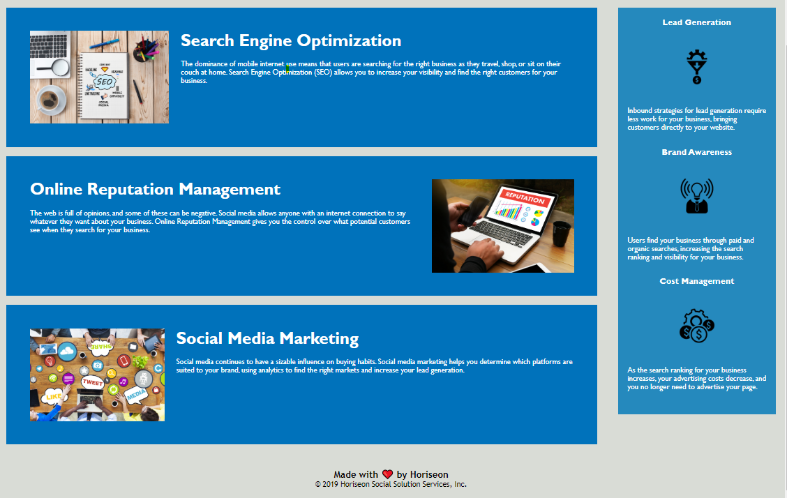

# accessiblity-code-refactor

The purpose of the Accessibilty Code Refactor repository is to structure Horiseon's existing webpage in order to respect current accissablity standards and to optimize their site for SEO. 

## Objective:

- Source code meets accessibility standards
- Semantic HTML elemants are used for readability
- Image elements have descriptive alt text
- Source code is cleaned up and optimized

[Code Refractor](https://diegopie.github.io/accessibility-code-refactor/) is hosted on GitHub pages. 

## Outcome: 

This project taught me a lot about having a goal in mind when writing a web page. Not just in terms of readability for the coder, but for readability for screen readers too. All of this will affect the end user in different ways. 
I was able to research how screen readers analyze one’s HTML and make adjustments to respect accessibility and SEO standards. Writing good alt text was something I struggled with as I had only ever used a few words to describe an image in the past. 
I would still like to optimize the current CSS styles to reduce redundancy, but I need to sharpen my CSS skills. I would also like to make adjustments so the page can scale across screen sizes. 

This appliaction was authored by [Diego Hernandez](https://github.com/Diegopie)